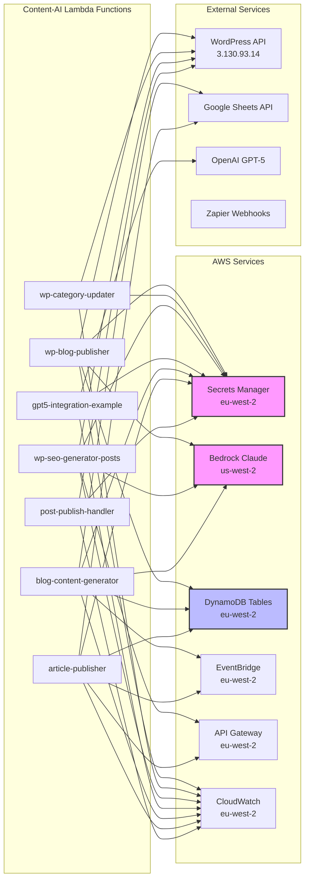
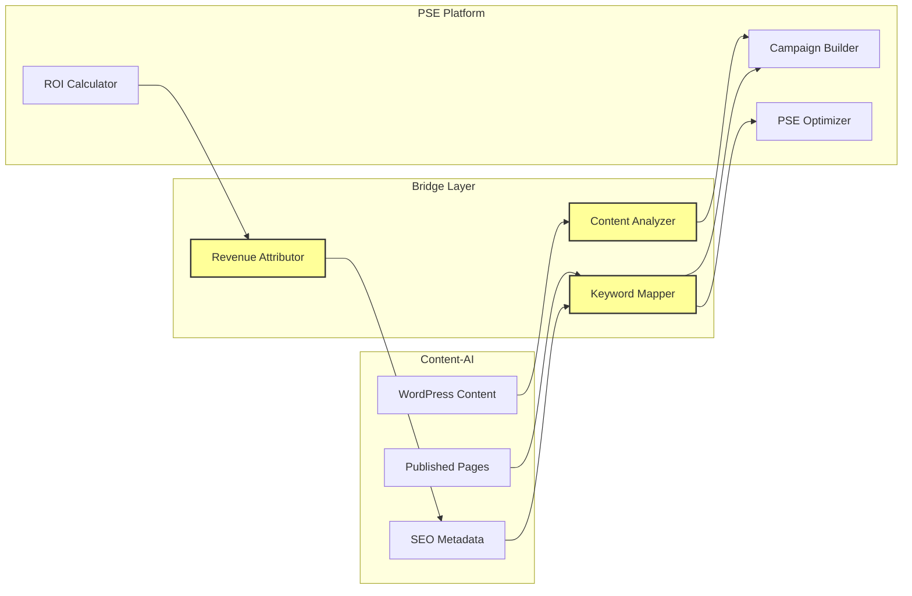

# PSE Platform - AWS Service Dependency Map
**Generated**: 2025-09-13
**Purpose**: Complete mapping of system components and their AWS service dependencies
**Status**: ✅ Phase 1, Item 1 Complete

---

## 🗺️ System Architecture Overview

### **Two Primary Systems Identified**
1. **Content-AI System** (Existing) - WordPress content generation and publishing
2. **PSE Arbitrage Platform** (Planned) - Traffic arbitrage and monetization engine

---

## 📊 AWS Service Dependencies by System

### 🔵 **CONTENT-AI SYSTEM (Currently Active)**

#### **Core AWS Services Used**
| Service | Region | Purpose | Critical |
|---------|--------|---------|----------|
| **Lambda** | eu-west-2 | Function execution | ✅ Yes |
| **Secrets Manager** | eu-west-2 | API credentials storage | ✅ Yes |
| **AWS Bedrock** | us-west-2 | Claude Opus 4.1 AI model | ✅ Yes |
| **API Gateway** | eu-west-2 | HTTP endpoints | ✅ Yes |
| **EventBridge** | eu-west-2 | Scheduled triggers | ✅ Yes |
| **DynamoDB** | eu-west-2 | Data storage & locks | ✅ Yes |
| **CloudWatch** | eu-west-2 | Logging & monitoring | ✅ Yes |
| **IAM** | Global | Access management | ✅ Yes |
| **S3** | eu-west-2 | Deployment packages | ⚠️ Medium |
| **Lightsail** | us-east-2 | WordPress hosting | ✅ Yes |

#### **Lambda Functions & Their Dependencies**



#### **DynamoDB Tables**
| Table Name | Purpose | TTL | Status |
|------------|---------|-----|--------|
| `blog-content-pipeline` | Content idea storage | 90 days | ✅ Active |
| `article-publishing-locks` | Prevent duplicate publishing | 5 minutes | ✅ Active |
| `content-generator-outputs` | Generated content storage | Variable | ✅ Active |
| `idempotency-table` | Prevent duplicate operations | 24 hours | ✅ Active |

#### **EventBridge Schedules**
| Rule Name | Function | Schedule | Status |
|-----------|----------|----------|--------|
| `blog-content-generator-daily` | blog-content-generator | 10:00 AM UK daily | ✅ Enabled |
| `article-publisher-6am` | article-publisher | 6:00 AM weekdays | ✅ Enabled |
| `article-publisher-9am` | article-publisher | 9:00 AM weekdays | ✅ Enabled |
| `article-publisher-12pm` | article-publisher | 12:00 PM weekdays | ✅ Enabled |
| `article-publisher-3pm` | article-publisher | 3:00 PM weekdays | ✅ Enabled |
| `article-publisher-6pm` | article-publisher | 6:00 PM weekdays | ✅ Enabled |

---

### 🟢 **PSE ARBITRAGE PLATFORM (Planned)**

#### **Proposed AWS Services Architecture**

```mermaid
graph TB
    subgraph "PSE Microservices Layer"
        MS1[high-cpc-keyword-hunter]
        MS2[pse-content-analyzer]
        MS3[pse-gap-detector]
        MS4[pse-page-optimizer]
        MS5[pse-campaign-builder]
        MS6[pse-revenue-attributor]
        MS7[pse-analytics-engine]
        MS8[pse-usage-optimizer]
        MS9[campaign-roi-optimizer]
        MS10[cost-collector]
        MS11[pse-kpi-calculator]
        MS12[pse-decision-engine]
    end

    subgraph "Proposed AWS Infrastructure"
        RDS[RDS Aurora<br/>PostgreSQL<br/>eu-west-2]
        DDB2[DynamoDB<br/>Unified Table<br/>eu-west-2]
        ECS[ECS Fargate<br/>eu-west-2]
        LMB[Lambda Functions<br/>eu-west-2]
        EB2[EventBridge<br/>Orchestration<br/>eu-west-2]
        S3B[S3 Buckets<br/>eu-west-2]
        CF[CloudFront<br/>Global]
        SM2[Secrets Manager<br/>eu-west-2]
        BR2[Bedrock Claude<br/>us-west-2]
    end

    subgraph "External APIs"
        GAD[Google Ads API]
        GAN[Google Analytics 4]
        GSC[Google Search Console]
        GKP[Google Keyword Planner]
        BNG[Bing Ads API]
        ADS[AdSense API]
    end

    MS1 --> GKP
    MS1 --> RDS
    MS2 --> BR2
    MS2 --> DDB2
    MS3 --> RDS
    MS4 --> LMB
    MS5 --> GAD
    MS5 --> BNG
    MS6 --> GAN
    MS6 --> ADS
    MS7 --> RDS
    MS8 --> DDB2
    MS9 --> RDS
    MS10 --> GAD
    MS11 --> RDS
    MS12 --> BR2
    MS12 --> EB2

    style RDS fill:#9f9,stroke:#333,stroke-width:2px
    style DDB2 fill:#bbf,stroke:#333,stroke-width:2px
    style BR2 fill:#f9f,stroke:#333,stroke-width:2px
```



#### **Proposed New AWS Resources**
| Service | Resource | Purpose | Region |
|---------|----------|---------|--------|
| **RDS Aurora** | `pse-platform-db` | Main data warehouse | eu-west-2 |
| **DynamoDB** | `unified-content-monetization` | Real-time metrics | eu-west-2 |
| **ECS Fargate** | `pse-microservices-cluster` | Container orchestration | eu-west-2 |
| **Lambda** | `pse-platform-*` functions | Serverless compute | eu-west-2 |
| **S3** | `pse-platform-assets` | Static assets & exports | eu-west-2 |
| **CloudFront** | PSE dashboard CDN | Global distribution | Global |
| **EventBridge** | `pse-orchestrator-rules` | Workflow automation | eu-west-2 |
| **API Gateway** | `pse-platform-api` | REST API endpoints | eu-west-2 |
| **CloudWatch** | PSE dashboards | Unified monitoring | eu-west-2 |

---

## 🔗 Integration Points Between Systems

### **Shared AWS Resources**
| Resource | Content-AI Use | PSE Platform Use | Conflict Risk |
|----------|---------------|------------------|---------------|
| **Secrets Manager** | API credentials | Will add Google Ads/Analytics | ✅ Low - different secrets |
| **AWS Bedrock** | Content generation | Content analysis & optimization | ⚠️ Medium - rate limits |
| **DynamoDB** | Publishing locks & content | Performance metrics | ✅ Low - separate tables |
| **Lambda Execution Role** | `wp-test-lambda-role` | New `pse-platform-role` | ✅ Low - separate roles |
| **EventBridge** | Content scheduling | Campaign automation | ✅ Low - separate rules |
| **CloudWatch** | Lambda logs | Unified dashboard | ✅ Low - separate log groups |

### **Cross-System Dependencies**



---

## 🚨 Critical Dependencies & Risks

### **High Priority Dependencies**
1. **AWS Bedrock (us-west-2)**
   - Used by: Both systems
   - Risk: Rate limiting, model availability
   - Mitigation: Implement fallback to GPT-5

2. **WordPress API (Lightsail)**
   - Used by: Content-AI (critical), PSE (planned)
   - Risk: Single point of failure
   - Mitigation: Implement caching layer

3. **Secrets Manager**
   - Used by: All Lambda functions
   - Risk: Access failures cascade to all systems
   - Mitigation: Local caching with TTL

### **Medium Priority Dependencies**
1. **DynamoDB**
   - Risk: Table capacity limits
   - Mitigation: Auto-scaling enabled

2. **EventBridge**
   - Risk: Schedule conflicts
   - Mitigation: Separate rule namespaces

3. **Google APIs**
   - Risk: Quota limits
   - Mitigation: Request batching

---

## 📈 Resource Utilization Analysis

### **Current Usage (Content-AI)**
| Service | Monthly Usage | Monthly Cost | Trend |
|---------|---------------|--------------|-------|
| Lambda | ~5,000 invocations | £2-5 | Stable |
| DynamoDB | <1GB storage | £1-2 | Growing |
| Bedrock | ~1,000 API calls | £10-20 | Growing |
| API Gateway | ~10,000 requests | £3-5 | Stable |
| Secrets Manager | 5 secrets | £2 | Stable |
| CloudWatch | 5GB logs | £2-3 | Stable |

### **Projected Additional Usage (PSE Platform)**
| Service | Monthly Usage | Monthly Cost | Notes |
|---------|---------------|--------------|-------|
| RDS Aurora | 10GB+ storage | £50-100 | Serverless v2 |
| Lambda | +20,000 invocations | £10-20 | 12 new functions |
| DynamoDB | +5GB storage | £5-10 | Performance data |
| ECS Fargate | 2 tasks continuous | £30-50 | Microservices |
| Bedrock | +5,000 API calls | £50-100 | Content analysis |
| CloudFront | 10GB transfer | £5-10 | Dashboard CDN |

---

## 🔐 Security & Compliance

### **IAM Role Segregation**
```yaml
Content-AI Roles:
  - wp-test-lambda-role (existing)
  - blog-content-generator-role
  - article-publisher-role

PSE Platform Roles (proposed):
  - pse-platform-lambda-role
  - pse-rds-access-role
  - pse-ecs-task-role
  - pse-analytics-role
```

### **Network Isolation**
- Content-AI: Public endpoints only
- PSE Platform: VPC with private subnets for RDS
- Cross-system: API Gateway with authentication

---

## 📋 Implementation Recommendations

### **Phase 1 Prerequisites** ✅
1. ✅ Document all existing AWS resources and dependencies
2. ✅ Identify shared vs isolated resources
3. ✅ Map integration points between systems
4. ✅ Assess resource conflicts and risks

### **Next Steps (Phase 2)**
1. Create unified DynamoDB schema design
2. Set up RDS Aurora Serverless v2 instance
3. Configure new IAM roles for PSE platform
4. Implement shared CloudWatch dashboard
5. Test Bedrock rate limits with both systems

### **Best Practices**
1. **Namespace all resources**: Use prefixes (`pse-platform-*`, `content-ai-*`)
2. **Separate IAM roles**: Don't reuse existing roles
3. **Monitor costs**: Set up billing alerts for new services
4. **Document everything**: Update this map as resources are created
5. **Test in isolation**: Deploy PSE platform in test mode first

---

## 📊 Dependency Matrix Summary

| AWS Service | Content-AI | PSE Platform | Shared | Risk Level |
|-------------|------------|--------------|--------|------------|
| Lambda | ✅ 7 functions | 🔄 12 planned | ❌ | Low |
| DynamoDB | ✅ 4 tables | 🔄 1 unified table | ❌ | Low |
| RDS Aurora | ❌ | 🔄 Required | ❌ | N/A |
| Bedrock | ✅ Critical | 🔄 Critical | ✅ | Medium |
| Secrets Manager | ✅ In use | 🔄 Will expand | ✅ | Low |
| EventBridge | ✅ 6 rules | 🔄 Multiple rules | ❌ | Low |
| API Gateway | ✅ 1 API | 🔄 1 new API | ❌ | Low |
| ECS Fargate | ❌ | 🔄 Required | ❌ | N/A |
| S3 | ⚠️ Limited | 🔄 Required | ❌ | Low |
| CloudFront | ❌ | 🔄 Required | ❌ | N/A |
| CloudWatch | ✅ In use | 🔄 Will expand | ✅ | Low |
| IAM | ✅ 3 roles | 🔄 4 new roles | ❌ | Low |

**Legend**: ✅ Active | 🔄 Planned | ❌ Not Shared | ⚠️ Limited Use

---

**Document Status**: ✅ Complete
**Last Updated**: 2025-09-13
**Next Review**: After Phase 2 implementation