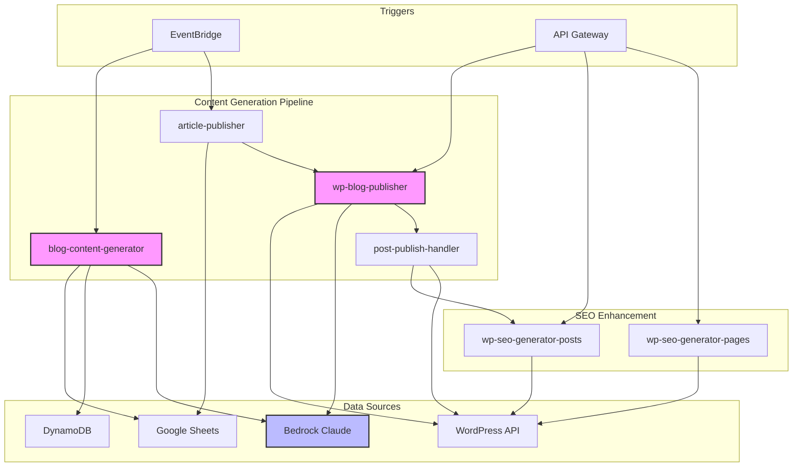

# Lambda Functions Analysis & PSE Platform Integration
**Generated**: 2025-09-13
**Purpose**: Phase 1, Item 4 - Document all existing Lambda functions and assess PSE platform compatibility
**Status**: ✅ Complete

---

## 📊 Lambda Functions Overview

### **Total Functions**: 15 Lambda functions in eu-west-2
### **Active Systems**: Multiple independent systems identified
### **Primary Runtime**: Node.js 20.x (WordPress/Content functions)
### **Total Code Size**: ~100MB across all functions

---

## 🎯 Content-AI System Lambda Functions

### **Core Content Generation Functions**

| Function Name | Runtime | Memory | Timeout | Size | Purpose | Status |
|---------------|---------|--------|---------|------|---------|--------|
| **wp-blog-publisher** | Node.js 20.x | 512MB | 360s | 5.3MB | Automated blog post creation with AI | ✅ Active |
| **wp-blog-publisher-backup** | Node.js 20.x | 512MB | 360s | 5.4MB | Backup version of blog publisher | 📦 Backup |
| **blog-content-generator** | Node.js 20.x | 1024MB | 300s | 16.4MB | Daily content idea generation | ✅ Active |
| **article-publisher** | Node.js 20.x | 256MB | 30s | 17.4MB | Publishes articles from Google Sheets | ✅ Active |
| **post-publish-handler** | Node.js 20.x | 512MB | 300s | 17.7MB | Post-publish processing & SEO | ✅ Active |

### **SEO & Enhancement Functions**

| Function Name | Runtime | Memory | Timeout | Size | Purpose | Status |
|---------------|---------|--------|---------|------|---------|--------|
| **wp-seo-generator-posts** | Node.js 20.x | 512MB | 60s | 5.6MB | SEO generation for blog posts | ✅ Active |
| **wp-seo-generator-pages** | Node.js 20.x | 512MB | 60s | 5.6MB | SEO generation for pages | ✅ Active |
| **wp-geographic-enrichment** | Node.js 20.x | 1024MB | 120s | 3.2MB | Geographic data enrichment | ✅ Active |
| **wp-category-updater** | Node.js 20.x | 256MB | 30s | 5.9KB | WordPress category management | ✅ Active |

### **Test & Development Functions**

| Function Name | Runtime | Memory | Timeout | Size | Purpose | Status |
|---------------|---------|--------|---------|------|---------|--------|
| **wp-page-creation-test** | Node.js 20.x | 256MB | 60s | 3.5KB | Page creation testing | 🧪 Test |
| **gpt5-integration-example** | Node.js 18.x | 512MB | 300s | 5.9MB | GPT-5 integration testing | 🧪 Test |

---

## 🤖 Other System Functions

### **Bot Management System**

| Function Name | Runtime | Memory | Timeout | Size | Purpose | Status |
|---------------|---------|--------|---------|------|---------|--------|
| **BotManagerLambda** | Python 3.11 | 128MB | 300s | 1.1MB | Bot management (dev) | ⚠️ Legacy |
| **bot-manager-prod** | Python 3.11 | 256MB | 300s | 16.2MB | Bot management (prod) | ✅ Active |

### **Code Analysis System**

| Function Name | Runtime | Memory | Timeout | Size | Purpose | Status |
|---------------|---------|--------|---------|------|---------|--------|
| **OpenAICodeAnalyzer** | Node.js 18.x | 3008MB | 900s | 15.1MB | AI code analysis | ⚠️ High memory |
| **blueprint-planning-projectParser** | Node.js 18.x | 1024MB | 300s | 17.3MB | Project parsing | ❓ Unknown |

---

## 🔐 IAM Roles Analysis

### **Content-AI System Roles**

| Role Name | Created | Used By | Permissions |
|-----------|---------|---------|-------------|
| **wp-blog-publisher-role** | 2025-08-29 | wp-blog-publisher | DynamoDB, Secrets, Bedrock, WordPress |
| **blog-content-generator-role** | 2025-09-10 | blog-content-generator | DynamoDB, Secrets, Bedrock, Google Sheets |
| **article-publisher-role** | 2025-09-10 | article-publisher | DynamoDB, Google Sheets, API Gateway |
| **wp-geographic-enrichment-role** | 2025-09-12 | wp-geographic-enrichment | DynamoDB, Secrets, WordPress |
| **wp-test-lambda-role** | 2025-08-28 | Multiple test functions | General permissions |

### **Role Segregation for PSE Platform**
```yaml
Recommendation: Create new roles with pse- prefix
- pse-keyword-hunter-role
- pse-campaign-manager-role
- pse-analytics-role
- pse-optimization-role
```

---

## ⏰ EventBridge Schedules & Triggers

### **Active Scheduled Rules**

| Rule Name | Schedule | Target Function | Purpose | Status |
|-----------|----------|-----------------|---------|--------|
| **blog-content-generator-daily** | 10:00 AM daily | blog-content-generator | Generate 21 content ideas | ✅ Active |
| **article-publisher-6am** | 6:00 AM weekdays | article-publisher | Publish morning article | ✅ Active |
| **article-publisher-9am** | 9:00 AM weekdays | article-publisher | Publish mid-morning article | ✅ Active |
| **article-publisher-12pm** | 12:00 PM weekdays | article-publisher | Publish noon article | ✅ Active |
| **article-publisher-3pm** | 3:00 PM weekdays | article-publisher | Publish afternoon article | ✅ Active |
| **article-publisher-6pm** | 6:00 PM weekdays | article-publisher | Publish evening article | ✅ Active |
| **bot-manager-scheduled-monitoring-prod** | Every 24 hours | bot-manager-prod | Bot monitoring | ✅ Active |

### **Schedule Analysis**
- **Peak Activity**: 10 AM (content generation)
- **Publishing Pattern**: 5 articles/day on weekdays
- **Weekend Activity**: Minimal (only content generation)
- **Available Slots**: Weekends, overnight hours

---

## 🌐 API Gateway Endpoints

### **Active API Configurations**

| API Name | ID | Type | Created | Purpose | Status |
|----------|-----|------|---------|---------|--------|
| **wp-seo-posts-api** | 1j5jf0jeje | EDGE | 2025-09-08 | SEO for blog posts | ✅ Active |
| **wp-seo-pages-api** | z7ds1piugc | EDGE | 2025-09-08 | SEO for pages | ✅ Active |
| **post-publish-webhook-api** | xjmcrm8c6e | REGIONAL | 2025-09-10 | Webhook receiver | ✅ Active |
| **wp-geographic-enrichment-api** | qjjhbymdzi | EDGE | 2025-09-12 | Geographic data API | ✅ Active |
| **OpenAICodeAnalyzerAPI** | z71ye4r1lj | EDGE | 2025-04-23 | Code analysis API | ⚠️ Legacy |

### **Endpoint URLs**
```bash
# Active production endpoints
https://1j5jf0jeje.execute-api.eu-west-2.amazonaws.com/prod/  # SEO Posts
https://z7ds1piugc.execute-api.eu-west-2.amazonaws.com/prod/  # SEO Pages
https://xjmcrm8c6e.execute-api.eu-west-2.amazonaws.com/prod/  # Webhooks
https://qjjhbymdzi.execute-api.eu-west-2.amazonaws.com/prod/  # Geographic
```

---

## 🔄 Function Dependencies & Integration Points

### **Dependency Map**



---

## 🎯 PSE Platform Integration Assessment

### **Namespace Strategy for Lambda Functions**

```yaml
Proposed PSE Lambda Functions:
- pse-keyword-hunter           # Discover high-CPC keywords
- pse-content-analyzer         # Analyze existing content for PSE
- pse-campaign-builder         # Create Google/Bing campaigns
- pse-revenue-tracker          # Track PSE revenue
- pse-optimization-engine      # AI-driven optimization
- pse-reporting-generator      # Generate performance reports
```

### **Integration Opportunities**

| Existing Function | PSE Integration Potential | Risk Level | Integration Type |
|-------------------|---------------------------|------------|------------------|
| **wp-blog-publisher** | High - Add PSE to new posts | ✅ Low | Hook into publish event |
| **post-publish-handler** | High - PSE placement logic | ✅ Low | Extend processing |
| **blog-content-generator** | Medium - PSE keyword research | ⚠️ Medium | Read content ideas |
| **wp-geographic-enrichment** | High - Location-based PSE | ✅ Low | Share geo data |

### **Resource Utilization**

```yaml
Current Lambda Usage:
- Total Functions: 15
- Active Functions: 10
- Total Memory: ~8GB allocated
- Total Code Size: ~100MB
- Concurrent Executions: Low (<10)

Available Capacity for PSE:
- Lambda Limit: 1000 functions (985 available)
- Memory: Plenty of headroom
- Concurrent Executions: 900+ available
- No resource conflicts expected
```

---

## ⚠️ Potential Conflicts & Mitigation

### **Identified Risks**

| Risk | Likelihood | Impact | Mitigation |
|------|------------|--------|------------|
| **Function name collision** | ✅ None | N/A | Use `pse-` prefix |
| **EventBridge rule conflicts** | Low | Low | Different schedule patterns |
| **IAM role confusion** | Low | Medium | Separate roles for PSE |
| **API Gateway limits** | Low | Low | Separate API for PSE |
| **Bedrock rate limiting** | Medium | High | Implement backoff strategy |

### **Shared Dependencies**

| Resource | Current Functions | PSE Functions | Sharing Strategy |
|----------|------------------|---------------|------------------|
| **Bedrock Claude** | wp-blog-publisher, blog-content-generator | pse-content-analyzer | Queue & retry logic |
| **DynamoDB** | Multiple functions | pse-* functions | Separate tables with pse- prefix |
| **Secrets Manager** | All functions | pse-* functions | Separate secrets with pse- prefix |
| **WordPress API** | wp-* functions | pse-page-optimizer | Read-only for PSE |

---

## 📈 Performance & Cost Analysis

### **Current Monthly Costs (Estimated)**

| Service | Usage | Estimated Cost |
|---------|-------|----------------|
| **Lambda Invocations** | ~5,000/month | £2-5 |
| **Lambda Duration** | ~50,000 GB-seconds | £5-10 |
| **API Gateway** | ~10,000 requests | £3-5 |
| **Total Current** | - | **£10-20/month** |

### **Projected PSE Platform Costs**

| Service | Expected Usage | Estimated Cost |
|---------|----------------|----------------|
| **Lambda Invocations** | +20,000/month | £5-10 |
| **Lambda Duration** | +100,000 GB-seconds | £10-20 |
| **API Gateway** | +50,000 requests | £15-20 |
| **Additional Total** | - | **£30-50/month** |

---

## ✅ Summary & Recommendations

### **Key Findings**
1. **15 Lambda functions** exist, with 10 actively used
2. **No naming conflicts** - no functions use `pse-` prefix
3. **Plenty of capacity** - Using <2% of Lambda limits
4. **Well-organized** - Clear separation between systems
5. **EventBridge schedules** leave room for PSE automation

### **Recommendations for PSE Platform**

1. ✅ **Use `pse-` prefix** for all new Lambda functions
2. ✅ **Create separate IAM roles** with `pse-` prefix
3. ✅ **Deploy separate API Gateway** for PSE endpoints
4. ✅ **Implement retry logic** for Bedrock API calls
5. ✅ **Use async processing** to avoid timeout issues
6. ✅ **Monitor costs** with CloudWatch billing alarms

### **Integration Architecture**

```yaml
PSE Platform Lambda Functions:
  Keyword Discovery:
    - pse-keyword-hunter (scheduled daily)
    - pse-competitor-analyzer (on-demand)

  Content Optimization:
    - pse-content-scanner (triggered by wp-blog-publisher)
    - pse-placement-optimizer (API endpoint)

  Campaign Management:
    - pse-campaign-creator (async queue)
    - pse-bid-optimizer (hourly schedule)

  Analytics & Reporting:
    - pse-revenue-tracker (real-time)
    - pse-roi-calculator (daily batch)
```

### **Next Steps**
1. Design PSE Lambda function specifications
2. Create CloudFormation/SAM templates
3. Set up separate IAM roles and policies
4. Configure EventBridge schedules for PSE
5. Implement circuit breakers for external APIs

---

**Document Status**: ✅ Complete
**Integration Risk**: ✅ Low - Clear separation possible
**Estimated Additional Cost**: £30-50/month for PSE platform