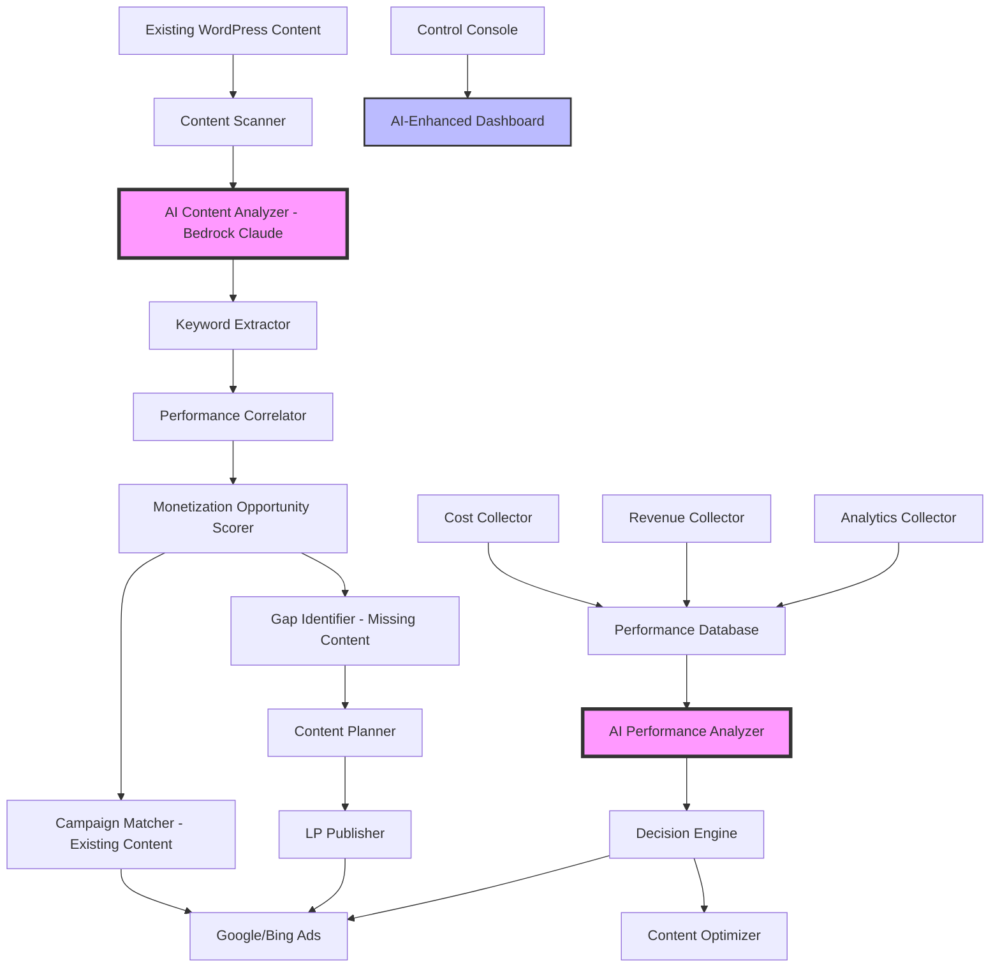

# SOP-000: Master Architecture Document
# Arbitrage Automation Platform

**Document ID**: SOP-000  
**System**: Arbitrage Automation Platform  
**Last Updated**: September 8, 2025  
**Status**: ✅ Active  
**Version**: 1.0.0

---

## 🎯 **Executive Summary**

The **Arbitrage Automation Platform** is an end-to-end, fully automated system for profitable traffic arbitrage across multiple websites. It automatically discovers high-value keywords, creates optimized landing pages, launches targeted advertising campaigns, and continuously optimizes for maximum ROI through data-driven decision making.

### **Business Model: Traffic Arbitrage**
```
Keywords → Landing Pages → Paid Traffic → Revenue (AdSense + Leads) → Profit
```

### **Key Value Propositions**
- **Fully Automated**: From keyword research to campaign optimization
- **Multi-Publisher**: Supports unlimited websites/verticals
- **Profitable Focus**: ROI-driven with automatic pause/scale decisions  
- **Scalable Architecture**: Cloud-native, serverless, cost-effective
- **Risk-Managed**: Multiple safeguards and spending controls

---

## 🏗️ **System Architecture Overview**

### **Intelligent Content-First Architecture**



### **Technology Stack**

#### **Infrastructure (AWS)**
- **Database**: PostgreSQL (RDS Aurora Serverless v2)
- **Compute**: AWS Lambda (Node.js 20.x) + ECS Fargate
- **Scheduling**: EventBridge (cron jobs)
- **Storage**: S3 (exports, backups)
- **Secrets**: AWS Secrets Manager
- **Monitoring**: CloudWatch + Custom dashboards

#### **Applications**
- **Backend Services**: Node.js/TypeScript microservices
- **Frontend Console**: Next.js 14 + TypeScript + Tailwind CSS  
- **Database ORM**: Prisma with PostgreSQL
- **Authentication**: NextAuth.js (Google OAuth)

#### **AI & Analytics Integration**
- **AWS Bedrock Claude**: Content analysis and optimization
- **Google Analytics 4**: Performance correlation and insights
- **Search Console API**: Organic keyword performance data
- **WordPress REST API**: Content scanning and publishing
- **Google Ads API**: Campaign management and optimization
- **Bing Ads API**: Multi-platform campaign deployment  
- **AdSense API**: Revenue data collection

---

## 📊 **Data Architecture & Flow**

### **Core Database Tables**

```sql
-- Publisher Management
publishers (id, name, domain, wp_credentials, settings)
projects (id, publisher_id, seed_keywords, locations, config)

-- Keyword Research & Content
keyword_runs (id, project_id, status, metadata)  
keywords (id, text, metrics, service, city, approved, publish_status)
pages (id, keyword_id, wp_post_id, url, acf_meta)

-- Advertising & Performance
campaigns (id, publisher_id, platform_id, budget, status)
ad_groups (id, campaign_id, name, match_type, cpc_bid)
costs_daily (date, keyword_id, spend, clicks, impressions)
revenue_daily (date, page_id, pageviews, earnings, leads)
performance_daily (date, roi, rpm, flag, confidence_days)

-- Automation & Decisions
decision_logs (id, decision_type, entity_id, action_taken, result)
optimization_rules (id, name, conditions, actions, enabled)
```

### **Data Contracts**

#### **1. Keyword Ingestion → keywords**
- **Input**: Project config (seeds, locations, filters)
- **Process**: Google Ads API → normalize CPC → extract service/city → apply approval rules
- **Output**: `keywords` table with `approved = true/false`

#### **2. Gap Checker → pages**  
- **Input**: Approved keywords without published pages
- **Process**: Check WordPress for existing pages → queue missing pages
- **Output**: Publishing queue + page status sync

#### **3. LP Publisher → WordPress**
- **Input**: Approved keywords + templates + ACF meta
- **Process**: WordPress REST API → create/update pages → set ACF fields
- **Output**: Live landing pages with tracking parameters

#### **4. Campaign Builder → Ad Platforms**
- **Input**: Published pages + keyword clusters + budget rules
- **Process**: Create campaigns/ad groups/ads → apply targeting/budgets → activate
- **Output**: Live ad campaigns with platform IDs stored

#### **5. Performance Tracking → KPIs**
- **Input**: Daily costs (Google/Bing) + revenue (AdSense/GA4/leads)  
- **Process**: Join by keyword/page → calculate ROI/RPM → apply business rules
- **Output**: `performance_daily` with WINNER/LOSER/TEST flags

#### **6. Decision Engine → Optimizations**
- **Input**: Performance flags + confidence thresholds + optimization rules
- **Process**: Apply conditions → generate actions → execute via APIs
- **Output**: Automated campaign changes + audit logs

---

## 🔄 **Automation Workflows**

### **Daily Operations Cadence**

#### **02:00 - 04:00: Data Ingestion**
```bash
# Keyword Research (Nightly)
keyword-ingestion-service
├── Fetch new keywords from Google Ads API  
├── Parse service/city from keyword text
├── Calculate approval status (CPC, volume, competition)
└── Store in keywords table

# Gap Detection
gap-checker-service  
├── Find approved keywords without pages
├── Queue missing pages for publishing
└── Update page status tracking
```

#### **04:00 - 06:00: Content Publishing**
```bash  
# Landing Page Creation
lp-publisher-service
├── Process publishing queue
├── Create WordPress pages via REST API
├── Set ACF meta fields (service, city, keyword, CPC)
├── Apply templates and content blocks
└── Update keywords.publish_status = 'published'
```

#### **06:00 - 07:00: Performance Data Collection**
```bash
# Cost Data (Previous Day)
cost-collector-service
├── Google Ads API → campaign/keyword spend data
├── Bing Ads API → campaign/keyword spend data  
└── Store in costs_daily table

# Revenue Data (Previous Day)  
revenue-collector-service
├── AdSense API → earnings by page
├── Google Analytics 4 → pageviews/conversions
├── Lead tracking → conversion value
└── Store in revenue_daily table
```

#### **07:00 - 08:00: KPI Calculation**
```bash
# Performance Analysis
kpi-calculator-service
├── Join costs_daily + revenue_daily by keyword/page
├── Calculate ROI = (revenue / spend) - 1
├── Calculate RPM = (revenue / pageviews) * 1000
├── Apply business rules for WINNER/LOSER/TEST flags
└── Store in performance_daily table
```

#### **08:00 - 09:00: Automated Optimizations**
```bash
# Decision Engine
decision-engine-service  
├── Query performance_daily for actionable flags
├── Apply optimization rules with confidence thresholds
├── Execute actions: pause losers, scale winners, adjust bids
├── Log all decisions and results
└── Send Slack digest with daily changes
```

### **Campaign Lifecycle Management**

#### **New Keyword → Live Campaign (Automated)**
1. **Keyword Research**: Google Ads API discovers "plumber birmingham" (£4.50 CPC, 800 volume)
2. **Approval**: Meets criteria (CPC ≥ £2, volume ≥ 100, competition = HIGH)  
3. **Page Creation**: WordPress page created at `/plumber-birmingham/`
4. **Campaign Launch**: Google Ads campaign "hsd-plumber-birmingham" with £20/day budget
5. **Monitoring**: Daily cost/revenue tracking begins
6. **Optimization**: After 3-7 days, system decides to pause/scale/optimize

#### **Performance-Based Decisions (Automated)**

**WINNER Logic:**
```javascript
if (roi >= 1.5 && confidence_days >= 7 && rpm_variance < 0.2) {
  actions = [
    "increase_budget_by_50_percent",
    "expand_to_similar_cities", 
    "test_enhanced_cpc_bidding"
  ];
}
```

**LOSER Logic:**  
```javascript
if (roi < 1.0 && pageviews >= 500 && confidence_days >= 3) {
  actions = [
    "pause_campaign",
    "analyze_search_terms", 
    "add_negative_keywords"
  ];
}
```

---

## 🎛️ **Control Console Features**

### **Multi-Publisher Dashboard**
- **Publisher Selector**: Switch between different websites  
- **Real-Time Status**: Live campaign counts, spend, revenue
- **Quick Actions**: Trigger keyword runs, pause campaigns, approve keywords
- **Health Monitoring**: API quotas, system errors, performance alerts

### **Keyword Management**
- **Research Results**: Searchable table with approval status
- **Bulk Operations**: Approve/reject multiple keywords  
- **Gap Analysis**: Missing pages highlighted with publish buttons
- **Search Intent Analysis**: Service/city extraction validation

### **Campaign Oversight**
- **Live Performance**: ROI, RPM, spend by campaign
- **Automated Decisions**: Audit trail of system actions
- **Manual Overrides**: Emergency pause, budget adjustments
- **A/B Testing**: Creative rotation and landing page variants

### **Analytics & Reporting**
- **ROI Trends**: Daily/weekly performance charts
- **Publisher Comparison**: Multi-site performance analysis  
- **Keyword Performance**: Top winners/losers with insights
- **Cost Efficiency**: CPC trends and budget utilization

### **User Management**
- **Google OAuth**: Domain-restricted organizational access
- **Role-Based Permissions**: Admin/Editor/Viewer access levels
- **Activity Logging**: Audit trail of manual actions
- **Alert Configuration**: Custom notification thresholds

---

## 💰 **Business Logic & Rules**

### **Keyword Selection Criteria**
```javascript
// Approval Rules
const approvalCriteria = {
  cpc_high_gbp: >= 2.0,           // Minimum CPC for profitability
  avg_monthly_searches: >= 100,    // Sufficient search volume
  competition: ['MEDIUM', 'HIGH'], // Commercial intent indicators
  blocked_terms: ['diy', 'free', 'jobs', 'salary', 'course'] // Non-commercial
};
```

### **Campaign Structure & Naming**
```javascript
// Naming Conventions  
campaign_name = `hsd-${service}-${city}`           // "hsd-plumber-birmingham"
ad_group_name = `${city}-${match_type}`           // "birmingham-exact"  
utm_campaign = `${service}-${city}`               // "plumber-birmingham"
final_url = `https://domain.com/${service}-${city}/` // Landing page URL
```

### **Budget & Bidding Strategy**
```javascript
// Initial Campaign Settings
const initialSettings = {
  daily_budget_gbp: 20,           // Conservative start
  bid_strategy: 'manual_cpc',     // Full control initially  
  geo_targeting: 'city_10km_radius', // Local targeting
  ad_schedule: '24_7',            // Gather data first
  device_targeting: 'all_devices' // Mobile + desktop
};

// Bid Strategy Progression (Performance-Based)
const bidProgression = [
  'manual_cpc',      // 0-7 days: Learn CPC landscape
  'enhanced_cpc',    // 7+ days: Light automation  
  'target_cpa',      // 30+ conversions: CPA optimization
  'target_roas'      // Stable lead values: ROAS optimization
];
```

### **Risk Management & Safeguards**
```javascript
// Spending Controls
const spendingLimits = {
  global_daily_cap_gbp: 500,      // Platform-wide limit
  publisher_daily_cap_gbp: 200,   // Per-site limit  
  campaign_daily_cap_gbp: 100,    // Per-campaign limit
  emergency_stop_threshold: 1000  // Immediate halt trigger
};

// Quality Gates
const qualityChecks = [
  'wordpress_page_exists',        // LP must be live
  'page_content_min_words: 300',  // Sufficient content
  'acf_fields_populated',         // Meta data complete
  'no_404_errors',               // Technical validation
  'adsense_ads_visible'          // Revenue potential
];
```

---

## 📈 **Revenue Model & KPIs**

### **Revenue Streams**
1. **AdSense Display Ads**: RPM-based earnings from page traffic
2. **Lead Generation Forms**: Fixed value per qualified lead submission  
3. **Affiliate Commissions**: Service provider partnerships (future)

### **Key Performance Indicators**

#### **Primary KPIs**
- **ROI (Return on Investment)**: `(total_revenue / total_spend) - 1`
- **RPM (Revenue per Mille)**: `(revenue / pageviews) * 1000`  
- **Conversion Rate**: `leads / unique_visitors`
- **Cost per Lead**: `total_spend / total_leads`

#### **Secondary KPIs**  
- **CTR (Click-Through Rate)**: Ad performance indicator
- **CPC (Cost per Click)**: Bidding efficiency  
- **Page Speed**: User experience metric
- **Organic Traffic %**: SEO effectiveness

#### **Business Intelligence**
- **Winner/Loser Distribution**: Portfolio health
- **Publisher Performance**: Multi-site comparison
- **Service/City Analysis**: Market opportunity identification  
- **Seasonal Trends**: Demand pattern recognition

### **Profitability Targets**
```javascript
// Performance Benchmarks
const targets = {
  break_even_roi: 1.0,           // 100% ROI minimum
  winner_threshold_roi: 1.5,      // 150% ROI for scaling
  target_rpm_gbp: 2.0,           // £2 RPM target
  max_cost_per_lead_gbp: 15,     // Lead value efficiency
  
  // Portfolio Targets
  winner_percentage: 0.3,         // 30% of campaigns profitable
  test_percentage: 0.5,          // 50% under evaluation  
  loser_percentage: 0.2          // 20% to be paused (acceptable)
};
```

---

## 🔐 **Security & Compliance**

### **Data Security**
- **Encryption**: All data encrypted at rest and in transit
- **API Keys**: Stored in AWS Secrets Manager with rotation
- **Database Access**: VPC-only with security groups
- **Application Security**: Input validation, SQL injection prevention

### **Access Control**  
- **Authentication**: Google OAuth with domain allowlist
- **Authorization**: Role-based permissions (Admin/Editor/Viewer)
- **Audit Logging**: All actions logged with user attribution
- **Session Management**: Secure token handling with expiration

### **Financial Controls**
- **Spending Limits**: Multiple levels of budget protection
- **Approval Workflows**: Manual approval for high-value changes  
- **Emergency Stops**: Kill switches for immediate campaign halt
- **Reconciliation**: Daily spend vs. budget variance alerts

### **Compliance Considerations**
- **GDPR**: EU user data protection (cookie consent, data retention)
- **Google Ads Policies**: Adherence to advertising guidelines
- **AdSense Policies**: Content quality and ad placement rules
- **WordPress Security**: Regular updates and security monitoring

---

## 🚀 **Implementation Roadmap**

### **Phase 1: Foundation (Sprint 1-2) - 4 weeks**
**Objective**: Build core data pipeline and basic automation

**Sprint 1 (2 weeks): Data Foundation**
- ✅ Database schema implementation (PostgreSQL)
- ✅ AWS infrastructure setup (RDS, Lambda, Secrets Manager)
- ✅ Keyword ingestion service (Google Ads API integration)
- ✅ Basic gap checker (identify missing pages)
- ✅ WordPress publisher service (REST API integration)

**Sprint 2 (2 weeks): Campaign Automation**
- 🔄 Campaign builder service (Google Ads campaign creation)
- 🔄 Cost collector service (daily spend tracking)
- 🔄 Basic console (trigger runs, view status)
- 🔄 Publisher configuration (HomeServiceDeals setup)

**Acceptance Criteria**:
- [ ] 100 keywords researched and approved automatically
- [ ] 20 WordPress pages published with ACF meta fields
- [ ] 5 Google Ads campaigns created and activated  
- [ ] Daily cost tracking functional and accurate

### **Phase 2: Intelligence (Sprint 3-4) - 4 weeks**  
**Objective**: Add revenue tracking and automated decision making

**Sprint 3 (2 weeks): Revenue & KPIs**
- 🔄 Revenue collector service (AdSense + GA4 + leads)
- 🔄 KPI calculator service (ROI, RPM, flags)
- 🔄 Performance database population
- 🔄 Basic decision engine (pause losers only)

**Sprint 4 (2 weeks): Optimization Loop**
- 🔄 Advanced decision engine (scale winners, bid strategies)
- 🔄 Notification system (Slack daily digest)  
- 🔄 Console dashboard (performance charts, manual overrides)
- 🔄 Error handling and rollback mechanisms

**Acceptance Criteria**:
- [ ] ROI calculated accurately for all active campaigns
- [ ] Automated campaign pausing for losing keywords
- [ ] Budget scaling for winning campaigns (50% increases)
- [ ] Daily Slack reports with key metrics and actions

### **Phase 3: Scale (Sprint 5-6) - 4 weeks**
**Objective**: Multi-publisher support and advanced optimization

**Sprint 5 (2 weeks): Multi-Publisher**  
- 🔄 Publisher management system
- 🔄 Tenant isolation and data scoping
- 🔄 Configuration validation and deployment
- 🔄 Second publisher onboarding (test vertical)

**Sprint 6 (2 weeks): Advanced Features**
- 🔄 A/B testing framework (ad creatives, landing pages)
- 🔄 Bing Ads integration (multi-platform campaigns)
- 🔄 Advanced analytics (cohort analysis, attribution)
- 🔄 Performance optimization (query optimization, caching)

**Acceptance Criteria**:
- [ ] Two publishers running simultaneously without interference  
- [ ] Creative rotation testing with statistical significance
- [ ] Bing Ads campaigns launched alongside Google Ads
- [ ] Console performance <2 second page loads

### **Phase 4: Production (Sprint 7-8) - 4 weeks**
**Objective**: Production readiness and advanced capabilities

**Sprint 7 (2 weeks): Production Hardening**
- 🔄 Comprehensive monitoring and alerting
- 🔄 Load testing and performance optimization  
- 🔄 Security audit and penetration testing
- 🔄 Disaster recovery and backup procedures

**Sprint 8 (2 weeks): Advanced Intelligence**  
- 🔄 Machine learning models (bid optimization, keyword scoring)
- 🔄 Predictive analytics (seasonal trends, market opportunities)
- 🔄 Advanced reporting (executive dashboards, API exports)
- 🔄 Third-party integrations (CRM, analytics platforms)

**Acceptance Criteria**:
- [ ] System handles 1000+ active campaigns simultaneously
- [ ] 99.9% uptime with automated failover
- [ ] Advanced ML models improve ROI by 20%+  
- [ ] Executive reporting with business insights

---

## 📊 **Technical Requirements**

### **Infrastructure Specifications**

#### **Database (PostgreSQL on AWS RDS)**
```yaml
Instance Class: db.r6g.xlarge (4 vCPU, 32 GB RAM)
Storage: 1TB GP3 SSD with auto-scaling to 10TB
Backup: 30-day retention with point-in-time recovery
Multi-AZ: Yes (production), Single-AZ (dev/staging)
Connections: 200 max concurrent connections
```

#### **Lambda Functions**
```yaml
Runtime: Node.js 20.x
Memory Allocation:
  - keyword-ingestion: 1GB (API heavy)
  - gap-checker: 512MB (database queries)
  - lp-publisher: 768MB (WordPress API + content)
  - campaign-builder: 1GB (Google Ads API)
  - cost-collector: 512MB (API calls + database)
  - revenue-collector: 768MB (multiple API integrations)
  - kpi-calculator: 512MB (database calculations)  
  - decision-engine: 1GB (complex rule processing)

Timeout: 15 minutes (max for complex operations)
Dead Letter Queue: Enabled for all functions
```

#### **Networking & Security**
```yaml
VPC: Custom VPC with public/private subnets
NAT Gateway: For Lambda internet access
Security Groups: 
  - Database: Port 5432 from Lambda subnets only
  - Lambda: HTTPS outbound to APIs
  - Console: HTTPS inbound from internet
```

### **Performance Requirements**
- **Response Time**: Console pages load <2 seconds
- **API Latency**: Service APIs respond <5 seconds  
- **Batch Processing**: 10,000 keywords processed <30 minutes
- **Concurrent Users**: Console supports 50 concurrent users
- **Data Retention**: 2 years of historical performance data

### **Scalability Targets**
- **Publishers**: Support 100+ publishers simultaneously
- **Keywords**: Process 100,000+ keywords daily  
- **Campaigns**: Manage 10,000+ active campaigns
- **Page Views**: Track 1M+ daily page views
- **Ad Spend**: Handle £50,000+ daily ad spend

---

## 📞 **Operational Procedures**

### **Daily Operations Checklist** 
#### **08:30 - Morning Health Check**
- [ ] Verify overnight automation completed successfully
- [ ] Review Slack digest for automated actions taken  
- [ ] Check for API errors or system alerts
- [ ] Validate spend vs. budget alignment
- [ ] Review new WINNER/LOSER flags

#### **12:00 - Midday Review**
- [ ] Monitor campaign performance trends
- [ ] Check for disapproved ads or policy violations
- [ ] Review search query reports for new negatives
- [ ] Validate landing page functionality (spot checks)

#### **17:00 - End of Day**
- [ ] Review daily spend and revenue totals
- [ ] Check for manual override opportunities
- [ ] Plan next day's keyword research topics
- [ ] Update stakeholders on performance trends

### **Weekly Operations Checklist**
#### **Monday - Performance Review**
- [ ] Analyze weekend performance patterns
- [ ] Review 7-day ROI trends for all campaigns
- [ ] Identify top performing keyword/city combinations
- [ ] Plan expansion to new cities or services

#### **Wednesday - Creative Optimization**  
- [ ] Review ad creative performance (CTR analysis)
- [ ] Rotate bottom 33% performing ads
- [ ] Test new headline and description variants
- [ ] Update landing page content based on search queries

#### **Friday - Strategic Planning**
- [ ] Weekly performance report generation
- [ ] Competitive analysis (new services, markets)
- [ ] Budget allocation planning for next week
- [ ] System optimization opportunities review

### **Monthly Operations Checklist**
#### **Month End - Business Review**
- [ ] Monthly ROI and profitability analysis
- [ ] Publisher performance comparison
- [ ] Market opportunity identification  
- [ ] System performance and cost optimization
- [ ] Security review and credential rotation

### **Emergency Procedures**

#### **High Spend Alert (>150% of daily budget)**
1. **Immediate**: Pause all campaigns via emergency dashboard
2. **Investigate**: Check for bid wars, disapproval issues, or API errors
3. **Analyze**: Review hourly spend patterns and traffic sources  
4. **Resolve**: Address root cause and adjust budgets/bids
5. **Resume**: Gradually re-enable campaigns with monitoring

#### **Revenue Drop Alert (>50% decrease day-over-day)**
1. **Immediate**: Check AdSense account status and payment setup
2. **Technical**: Verify ad placement and page load speeds
3. **Traffic**: Analyze organic vs. paid traffic changes
4. **Content**: Check for policy violations or content issues
5. **Escalate**: Contact AdSense support if revenue issue persists

#### **System Outage (Services unresponsive)**
1. **Status**: Check AWS service health dashboard
2. **Isolate**: Identify failed services via CloudWatch logs  
3. **Rollback**: Revert to last known good configuration
4. **Communicate**: Update stakeholders via Slack/email
5. **Resolve**: Address root cause and implement monitoring

---

## 📚 **Documentation & Knowledge Management**

### **Standard Operating Procedures (SOPs)**
- **SOP-001**: Daily Operations and Monitoring
- **SOP-002**: Weekly Optimization Procedures  
- **SOP-003**: Monthly Strategic Review Process
- **SOP-004**: Emergency Response and Troubleshooting
- **SOP-005**: New Publisher Onboarding
- **SOP-006**: Campaign Creation and Management
- **SOP-007**: Landing Page Optimization
- **SOP-008**: Performance Analysis and Reporting

### **Technical Documentation**
- **API Documentation**: Service endpoints and data contracts
- **Database Schema**: Table relationships and constraints
- **Deployment Guide**: Infrastructure setup and configuration  
- **Monitoring Guide**: Alert setup and troubleshooting
- **Security Guide**: Access controls and credential management

### **Training Materials**
- **Console User Guide**: Dashboard navigation and features
- **Campaign Manager Training**: Optimization best practices
- **Analytics Interpretation**: KPI analysis and decision making
- **Emergency Response**: Crisis management procedures

---

## 🎯 **Success Metrics & KPIs**

### **Financial Performance**
- **Monthly Profit**: Target £10,000+ monthly profit per publisher
- **ROI Distribution**: 30% winners (>150% ROI), 20% losers (<100% ROI)  
- **Cost Efficiency**: Average cost per lead <£15
- **Revenue Growth**: 20% month-over-month growth target

### **Operational Excellence**  
- **System Uptime**: 99.9% availability target
- **Automation Success**: 95% of decisions executed without manual intervention
- **Data Accuracy**: <1% variance between projected and actual spend
- **Processing Speed**: Daily batch jobs complete within 4-hour window

### **Business Intelligence**
- **Market Coverage**: Identify and enter 3+ new profitable verticals annually
- **Geographic Expansion**: Launch in 50+ UK cities per publisher
- **Competitive Advantage**: Maintain 20%+ ROI advantage over manual management
- **Predictive Accuracy**: Machine learning models predict performance within 15%

### **Risk Management**
- **Loss Prevention**: <5% of daily budget lost to unprofitable campaigns
- **Compliance**: Zero policy violations or account suspensions
- **Security**: No data breaches or unauthorized access incidents
- **Quality Control**: >95% of landing pages pass quality audits

---

## 🔮 **Future Roadmap & Enhancements**

### **Q1 2026: Advanced Intelligence**
- **Machine Learning Models**: Automated bid optimization and keyword scoring
- **Predictive Analytics**: Seasonal demand forecasting and budget allocation
- **Natural Language Processing**: Automated ad copy generation from landing pages
- **Competitive Intelligence**: Automated competitor analysis and response

### **Q2 2026: Platform Expansion**
- **Additional Ad Platforms**: Facebook Ads, LinkedIn Ads integration
- **Content Management**: Automated blog post creation for SEO
- **Social Media**: Automated social content distribution
- **Video Advertising**: YouTube and video platform integration

### **Q3 2026: Enterprise Features**
- **White Label Solution**: Multi-tenant platform for agencies
- **API Marketplace**: Third-party integrations and extensions
- **Advanced Reporting**: Custom dashboards and executive reporting  
- **Workflow Automation**: Advanced rule builder and approval workflows

### **Q4 2026: Global Expansion**
- **Multi-Country Support**: Localized campaigns for EU, US, Australia
- **Currency Management**: Multi-currency tracking and conversion
- **Language Processing**: Automated translation and localization
- **Regional Compliance**: GDPR, CCPA, and local advertising regulations

---

## 📝 **Conclusion**

The **Arbitrage Automation Platform** represents a comprehensive solution for profitable, scalable traffic arbitrage across multiple publishers. By combining advanced automation, data-driven decision making, and robust risk management, the platform enables sustainable, hands-off profit generation from organic keyword opportunities.

### **Key Success Factors**
1. **Automation First**: Minimize manual intervention while maintaining control
2. **Data-Driven Decisions**: ROI-focused optimization with statistical confidence  
3. **Risk Management**: Multiple safeguards protect against losses
4. **Scalable Architecture**: Cloud-native design supports unlimited growth
5. **Continuous Optimization**: Machine learning improves performance over time

### **Expected Outcomes**
- **Financial**: £10,000+ monthly profit per publisher within 6 months
- **Operational**: 95% automation with 5% manual oversight
- **Strategic**: Market leadership in automated arbitrage technology
- **Scalability**: Platform ready for 100+ publishers and multiple verticals

---

**Document Status**: Living document, updated with each system enhancement  
**Review Schedule**: Monthly updates, quarterly strategic reviews  
**Approval**: System architecture approved for implementation  
**Next Review**: October 8, 2025