# SOP-001: PSE Revenue Engine Architecture
# High-CPC Programmable Search Engine Arbitrage Platform

**Document ID**: SOP-001  
**System**: PSE Revenue Engine  
**Last Updated**: September 8, 2025  
**Status**: ✅ Active - CORE REVENUE MODEL  
**Revenue Model**: HIGH-CPC PSE ARBITRAGE

---

## 🎯 **THE PSE REVENUE ENGINE CONCEPT**

### **Revolutionary Business Model:**
```
High-CPC Keywords (£5-15 CPC) → Landing Pages with PSE → 
User Searches High-CPC Terms in PSE → 
PSE Ad Clicks (£5-15 revenue) → MASSIVE PROFIT
```

### **Why This Model Crushes Traditional Arbitrage:**
- **Revenue Multiplication**: One £5 paid click → Multiple £5+ PSE searches
- **Intent Amplification**: Users refine searches = more revenue opportunities  
- **CPC Leverage**: Use expensive keywords to generate expensive PSE clicks
- **Search Behavior**: Natural user behavior = sustainable revenue
- **Scalability**: Unlimited keywords × unlimited searches × unlimited revenue

---

## 🏗️ **PSE-CENTRIC SYSTEM ARCHITECTURE**

### **Core Revenue Flow:**

```mermaid
graph TB
    A[High-CPC Google Ads Campaign] --> B[Landing Page with PSE]
    B --> C[Keyword Passed via UTM]
    C --> D[PSE Pre-filled with High-CPC Term]
    D --> E[User Searches in PSE]
    E --> F[PSE Shows High-CPC Ads]
    F --> G[User Clicks £5-15 CPC Ad]
    G --> H[AdSense Revenue to YOU]
    
    I[Content Analysis] --> J[High-CPC Keyword Extraction]
    J --> K[PSE Landing Page Creation]
    K --> L[Campaign Targeting]
    L --> A
    
    M[PSE Analytics] --> N[Revenue Optimization]
    N --> O[Keyword Bidding Strategy]
    O --> A
    
    style H fill:#0f0,stroke:#333,stroke-width:4px
    style D fill:#f9f,stroke:#333,stroke-width:3px
    style G fill:#0f0,stroke:#333,stroke-width:3px
```


### **PSE Revenue Optimization Layers:**

#### **Layer 1: High-CPC Keyword Intelligence**
- **CPC Threshold**: Minimum £5 CPC (higher = better PSE revenue)
- **Competition Analysis**: Target keywords with 10+ advertisers
- **Search Volume**: Balance volume with CPC (prefer high-CPC over high-volume)
- **Commercial Intent**: Focus on "buying now" keywords

#### **Layer 2: PSE Landing Page Optimization**  
- **PSE Prominence**: Search box as primary CTA (not phone/contact)
- **Search Encouragement**: Copy that triggers more searching
- **Keyword Pre-filling**: UTM → PSE auto-population
- **Related Suggestions**: Encourage additional high-CPC searches

#### **Layer 3: PSE Revenue Tracking**
- **Search Analytics**: Track what users search in PSE
- **Click Analytics**: Revenue per PSE search/click  
- **Keyword Performance**: Which terms generate most PSE revenue
- **User Behavior**: Search patterns and revenue correlation

#### **Layer 4: Campaign Optimization**
- **PSE ROI Bidding**: Bid based on PSE revenue potential (not just traffic)
- **Landing Page Testing**: Optimize for PSE usage rates
- **Keyword Expansion**: Find more high-CPC variations
- **Negative Keywords**: Block low-CPC terms that waste budget

---

## 💰 **HIGH-CPC REVENUE MATHEMATICS**

### **Revenue Potential Analysis:**
```javascript
// Example: "Emergency Plumber London"
const scenarios = {
  conservative: {
    paid_cpc: 8.00,           // What we pay Google
    pse_searches_per_visit: 1.2, // Average PSE searches per visitor
    pse_click_rate: 0.15,     // 15% of PSE searches = clicks
    pse_revenue_per_click: 6.00, // AdSense revenue per PSE click
    
    // Revenue per paid visitor:
    revenue_per_visitor: 1.2 * 0.15 * 6.00, // = £1.08
    roi: (1.08 / 8.00) - 1,  // = -86.5% (BREAK EVEN NEED OPTIMIZATION)
  },
  
  optimized: {
    paid_cpc: 8.00,           // What we pay Google
    pse_searches_per_visit: 2.5, // Optimized PSE encouragement  
    pse_click_rate: 0.25,     // Better PSE placement & UX
    pse_revenue_per_click: 7.50, // Higher quality PSE searches
    
    // Revenue per paid visitor:
    revenue_per_visitor: 2.5 * 0.25 * 7.50, // = £4.69
    roi: (4.69 / 8.00) - 1,  // = -41% (GETTING BETTER)
  },
  
  profitable: {
    paid_cpc: 8.00,           // What we pay Google  
    pse_searches_per_visit: 3.2, // Multiple searches encouraged
    pse_click_rate: 0.35,     // Highly optimized PSE experience
    pse_revenue_per_click: 9.00, // Premium high-CPC searches
    
    // Revenue per paid visitor:
    revenue_per_visitor: 3.2 * 0.35 * 9.00, // = £10.08
    roi: (10.08 / 8.00) - 1, // = +26% ROI! 🎉
  },
  
  scaled: {
    paid_cpc: 8.00,           // What we pay Google
    pse_searches_per_visit: 4.0, // Expert PSE optimization
    pse_click_rate: 0.40,     // Perfect PSE design & content
    pse_revenue_per_click: 11.00, // Ultra-high-CPC searches
    
    // Revenue per paid visitor:
    revenue_per_visitor: 4.0 * 0.40 * 11.00, // = £17.60  
    roi: (17.60 / 8.00) - 1, // = +120% ROI! 🚀💰
  }
};
```

### **Key Success Metrics:**
- **PSE Usage Rate**: % visitors who use PSE (Target: 70%+)
- **Searches per Visitor**: Average PSE searches (Target: 3.0+)  
- **PSE Click Rate**: % PSE searches → clicks (Target: 30%+)
- **Revenue per PSE Click**: AdSense earnings (Target: £8+)
- **Overall PSE ROI**: (PSE Revenue / Paid CPC) - 1 (Target: 100%+)

---

## 🎯 **PSE LANDING PAGE STRATEGY**

### **Page Structure for Maximum PSE Revenue:**

#### **Above the Fold (Critical PSE Zone):**
```html
<div class="pse-hero-section">
  <h1>Find Emergency Plumbers in London</h1>
  <p>Search for specific plumbing services in your area:</p>
  
  <!-- PSE PROMINENTLY DISPLAYED -->
  <div class="pse-search-container">
    <gcse:search 
      data-queryParameterName="utm_term"
      data-autoCompleteMaxSuggestions="8"
      data-gaQueryParameter="pse_search">
    </gcse:search>
  </div>
  
  <div class="search-suggestions">
    <span>Popular searches:</span>
    <a href="#" onclick="searchPSE('emergency plumber london')">Emergency Plumber</a>
    <a href="#" onclick="searchPSE('24 hour plumber london')">24 Hour Service</a>
    <a href="#" onclick="searchPSE('boiler repair london')">Boiler Repair</a>
    <a href="#" onclick="searchPSE('drain cleaning london')">Drain Cleaning</a>
  </div>
</div>
```

#### **Content Strategy for PSE Optimization:**
- **Search Intent Copy**: "Find exactly what you need" vs "Call us now"
- **Problem Amplification**: List multiple issues to trigger specific searches
- **Local Variations**: Encourage searches for "near me", postcodes, districts
- **Service Granularity**: Break broad services into specific searchable terms

### **PSE Integration & Tracking:**

#### **UTM to PSE Auto-Population:**
```javascript
// Extract high-CPC keyword from UTM and pre-fill PSE
document.addEventListener('DOMContentLoaded', function() {
  const urlParams = new URLSearchParams(window.location.search);
  const keyword = urlParams.get('utm_term') || 
                 urlParams.get('utm_campaign') ||
                 extractFromPath();
                 
  if (keyword) {
    // Pre-fill PSE search box
    const searchInput = document.querySelector('.gsc-input input');
    if (searchInput) {
      searchInput.value = keyword.replace(/-/g, ' ');
      
      // Track pre-filled keyword
      gtag('event', 'pse_prefill', {
        'keyword': keyword,
        'source': 'utm_term'
      });
    }
  }
});

function searchPSE(query) {
  // Programmatically trigger PSE search
  const searchInput = document.querySelector('.gsc-input input');
  searchInput.value = query;
  
  // Trigger search
  const searchButton = document.querySelector('.gsc-search-button');
  searchButton.click();
  
  // Track suggested search
  gtag('event', 'pse_suggested_search', {
    'keyword': query,
    'source': 'suggestion_click'
  });
}
```

#### **PSE Analytics Tracking:**
```javascript
// Track PSE interactions and revenue
function initPSETracking() {
  // Track PSE searches
  google.search.cse.element.render({
    div: "pse-container",
    tag: 'search',
    gname: 'pse_search',
    attributes: {
      'queryParameterName': 'utm_term',
      'gaQueryParameter': 'pse_search'
    }
  });
  
  // Track PSE ad clicks
  document.addEventListener('click', function(e) {
    if (e.target.closest('.gsc-adBlock')) {
      gtag('event', 'pse_ad_click', {
        'search_term': getCurrentPSEQuery(),
        'ad_position': getAdPosition(e.target),
        'estimated_revenue': estimateRevenueFromKeyword(getCurrentPSEQuery())
      });
    }
  });
}

function getCurrentPSEQuery() {
  return document.querySelector('.gsc-input input').value;
}

function estimateRevenueFromKeyword(keyword) {
  // Estimate revenue based on keyword CPC data
  const cpcEstimates = {
    'emergency plumber': 8.50,
    '24 hour plumber': 7.25,
    'boiler repair': 6.80,
    // ... more keyword estimates
  };
  
  return cpcEstimates[keyword.toLowerCase()] || 5.00;
}
```

---

## 🚀 **HIGH-CPC CAMPAIGN STRATEGY**

### **Campaign Structure for PSE Revenue:**

#### **Campaign Naming & Organization:**
```javascript
// PSE-Optimized Campaign Structure
const campaignStructure = {
  campaign: "PSE-{service}-{city}-HighCPC", // "PSE-Plumber-London-HighCPC"
  adGroups: [
    {
      name: "Emergency-Exact-£8+",      // High-CPC emergency terms
      keywords: [
        "[emergency plumber london]",    // £8.50 CPC
        "[24 hour plumber london]",      // £7.80 CPC  
        "[urgent plumber london]"        // £6.90 CPC
      ],
      bid_strategy: "maximize_pse_revenue"
    },
    {
      name: "Repair-Exact-£6+",         // High-CPC repair terms
      keywords: [
        "[boiler repair london]",        // £6.80 CPC
        "[drain repair london]",         // £6.20 CPC
        "[pipe repair london]"           // £5.90 CPC
      ]
    }
  ]
};
```

#### **Ad Copy for PSE Optimization:**
```javascript
const pseOptimizedAds = [
  {
    headline1: "Find Emergency Plumbers London",
    headline2: "Search Local Plumbing Services",  
    headline3: "Compare Prices & Reviews",
    description1: "Search for exactly what you need. Emergency, 24-hour, boiler repair & more. Find the perfect plumber in your area.",
    description2: "Get quotes from verified local plumbers. Search by service type, location & availability.",
    finalURL: "https://homeservicedeals.pro/plumber-london/?utm_term=emergency-plumber-london"
  },
  {
    // Focus on SEARCH behavior, not direct conversion
    headline1: "London Plumber Directory", 
    headline2: "Find Your Perfect Match",
    headline3: "Emergency to Routine Services",
    description1: "Search our comprehensive directory of London plumbers. Filter by service type, area, and availability.",
    description2: "From emergency repairs to planned installations. Find exactly what you need with our search tool.",
    finalURL: "https://homeservicedeals.pro/plumber-london/?utm_term=plumber-directory-london"
  }
];
```

### **Bidding Strategy for PSE Revenue:**
```javascript
// PSE Revenue-Based Bidding Algorithm
function calculatePSEBid(keyword) {
  const keywordData = getKeywordData(keyword);
  
  const pseRevenuePotential = 
    keywordData.estimated_cpc * 0.7 *        // AdSense revenue rate
    keywordData.pse_usage_rate *              // % who use PSE
    keywordData.avg_searches_per_visit *      // Searches per visitor
    keywordData.pse_click_rate;               // PSE click rate
    
  const targetROI = 1.5; // 150% ROI target
  const maxBid = pseRevenuePotential / targetROI;
  
  return Math.min(maxBid, keywordData.estimated_cpc * 0.8); // Cap at 80% of estimated CPC
}

// Bid adjustment factors
const bidAdjustments = {
  mobile: 1.2,        // Higher PSE usage on mobile
  evening: 1.15,      // Emergency searches peak
  weekend: 1.3,       // Emergency premium  
  winter: 1.25,       // Heating emergency season
  london: 1.4,        // Premium CPC area
  "near me": 1.2      // High-intent modifier
};
```

---

## 📊 **PSE REVENUE TRACKING & OPTIMIZATION**

### **Database Schema for PSE Analytics:**

#### **PSE Performance Tables:**
```sql
-- Track PSE interactions and revenue
CREATE TABLE pse_interactions (
    id UUID PRIMARY KEY DEFAULT uuid_generate_v4(),
    page_id UUID NOT NULL REFERENCES pages(id),
    session_id VARCHAR(255),
    
    -- PSE usage tracking
    pse_loaded BOOLEAN DEFAULT FALSE,
    pse_searches INTEGER DEFAULT 0,
    pse_clicks INTEGER DEFAULT 0,
    
    -- Search details
    search_queries JSONB DEFAULT '[]', -- Array of search terms
    clicked_ads JSONB DEFAULT '[]',    -- Array of ad click data
    
    -- Revenue correlation  
    estimated_pse_revenue DECIMAL(10,4) DEFAULT 0,
    actual_adsense_revenue DECIMAL(10,4),
    
    -- Timing
    session_start TIMESTAMP WITH TIME ZONE DEFAULT NOW(),
    session_end TIMESTAMP WITH TIME ZONE,
    
    created_at TIMESTAMP WITH TIME ZONE DEFAULT NOW()
);

-- Track individual PSE searches
CREATE TABLE pse_searches (
    id UUID PRIMARY KEY DEFAULT uuid_generate_v4(),
    interaction_id UUID NOT NULL REFERENCES pse_interactions(id),
    
    -- Search details
    search_query VARCHAR(500) NOT NULL,
    search_source VARCHAR(100), -- 'prefilled', 'manual', 'suggestion'
    
    -- Results and clicks
    results_shown INTEGER,
    ads_shown INTEGER,
    ad_clicks INTEGER DEFAULT 0,
    
    -- Revenue tracking
    estimated_cpc DECIMAL(10,4),
    actual_revenue DECIMAL(10,4),
    
    searched_at TIMESTAMP WITH TIME ZONE DEFAULT NOW()
);

-- High-CPC keyword performance
CREATE TABLE high_cpc_keywords (
    id UUID PRIMARY KEY DEFAULT uuid_generate_v4(),
    publisher_id UUID NOT NULL REFERENCES publishers(id),
    
    -- Keyword data
    keyword VARCHAR(500) NOT NULL,
    service_category VARCHAR(100),
    city VARCHAR(100),
    
    -- CPC and competition data
    google_ads_cpc DECIMAL(10,4) NOT NULL,
    adsense_cpc_estimate DECIMAL(10,4),
    competition_level INTEGER, -- 1-10 scale
    
    -- PSE performance
    pse_usage_rate DECIMAL(5,4), -- % of visitors who search
    avg_pse_searches DECIMAL(4,2), -- Average searches per visitor
    pse_click_rate DECIMAL(5,4), -- % searches that get clicks
    pse_revenue_per_visitor DECIMAL(10,4),
    
    -- Campaign performance
    campaign_active BOOLEAN DEFAULT FALSE,
    campaign_cpc DECIMAL(10,4),
    campaign_roi DECIMAL(8,4),
    
    last_updated TIMESTAMP WITH TIME ZONE DEFAULT NOW(),
    created_at TIMESTAMP WITH TIME ZONE DEFAULT NOW()
);
```

### **PSE Revenue Optimization Services:**

#### **PSE Analytics Service:**
```javascript
// Analyze PSE performance and optimize revenue
class PSEAnalyticsService {
  
  async analyzePSEPerformance(pageId, dateRange) {
    const pseData = await this.db.query(`
      SELECT 
        AVG(pse_searches) as avg_searches_per_visit,
        AVG(pse_clicks) as avg_clicks_per_visit, 
        SUM(estimated_pse_revenue) / COUNT(*) as revenue_per_visitor,
        COUNT(CASE WHEN pse_searches > 0 THEN 1 END)::float / COUNT(*) as pse_usage_rate
      FROM pse_interactions 
      WHERE page_id = $1 AND session_start >= $2
    `, [pageId, dateRange.start]);
    
    return {
      pse_usage_rate: pseData.pse_usage_rate,
      searches_per_visitor: pseData.avg_searches_per_visit,
      clicks_per_visitor: pseData.avg_clicks_per_visit,
      revenue_per_visitor: pseData.revenue_per_visitor,
      optimization_score: this.calculatePSEScore(pseData)
    };
  }
  
  calculatePSEScore(data) {
    // Score PSE performance for optimization
    const weights = {
      usage_rate: 0.3,      // Getting people to use PSE
      searches_per_visit: 0.25, // Multiple searches per visit
      click_rate: 0.25,     // PSE searches → clicks  
      revenue_per_click: 0.2 // High-CPC clicks
    };
    
    return (
      (data.pse_usage_rate * weights.usage_rate) +
      (Math.min(data.avg_searches_per_visit / 3, 1) * weights.searches_per_visit) +
      (data.avg_clicks_per_visit * weights.click_rate) +
      (Math.min(data.revenue_per_visitor / 10, 1) * weights.revenue_per_click)
    ) * 100;
  }
  
  async optimizePSEBidding(keywordId) {
    const keyword = await this.getKeywordWithPSEData(keywordId);
    
    const pseROI = (keyword.pse_revenue_per_visitor / keyword.current_cpc) - 1;
    
    if (pseROI > 1.5) {
      // Scale up: Increase bids for highly profitable PSE keywords
      return {
        action: 'increase_bid',
        new_bid: keyword.current_cpc * 1.2,
        reason: `PSE ROI of ${(pseROI * 100).toFixed(1)}% - scale up`
      };
    } else if (pseROI < 0.5) {
      // Reduce or pause: Low PSE performance
      return {
        action: 'reduce_bid',
        new_bid: keyword.current_cpc * 0.8,
        reason: `PSE ROI of ${(pseROI * 100).toFixed(1)}% - optimize`
      };
    }
    
    return { action: 'maintain', reason: 'PSE performance within target range' };
  }
}
```

---

## 🎯 **PSE CONTENT OPTIMIZATION STRATEGY**

### **Content Types for Maximum PSE Revenue:**

#### **1. Problem-Solution Landing Pages:**
```javascript
// Content designed to trigger multiple PSE searches
const problemSolutionContent = {
  headline: "London Plumbing Problems? Find Your Solution",
  
  problems: [
    {
      problem: "Burst Pipe Emergency", 
      pse_trigger: "Search: emergency pipe repair london"
    },
    {
      problem: "Boiler Not Working",
      pse_trigger: "Search: boiler repair london"  
    },
    {
      problem: "Blocked Drain",
      pse_trigger: "Search: drain cleaning london"
    },
    {
      problem: "No Hot Water", 
      pse_trigger: "Search: hot water repair london"
    }
  ],
  
  cta: "Search for your specific problem above to find qualified professionals"
};
```

#### **2. Service Directory Pages:**
```javascript
// Comprehensive service pages that encourage granular searching
const serviceDirectoryContent = {
  headline: "Complete Plumbing Services in London",
  
  services: [
    {
      category: "Emergency Services (24/7)",
      searches: [
        "emergency plumber london",     // £8.50 CPC
        "24 hour plumber london",       // £7.80 CPC
        "weekend plumber london"        // £6.90 CPC
      ]
    },
    {
      category: "Boiler & Heating", 
      searches: [
        "boiler repair london",         // £6.80 CPC
        "boiler installation london",   // £7.20 CPC
        "heating engineer london"       // £6.40 CPC  
      ]
    },
    {
      category: "Drain & Pipe Services",
      searches: [
        "drain cleaning london",        // £5.90 CPC
        "pipe repair london",           // £6.20 CPC
        "sewer repair london"           // £7.10 CPC
      ]
    }
  ]
};
```

### **PSE UX Optimization:**

#### **Search Experience Design:**
```css
/* PSE styling for maximum usage */
.pse-container {
  background: linear-gradient(135deg, #667eea 0%, #764ba2 100%);
  padding: 40px;
  border-radius: 12px;
  text-align: center;
  margin: 20px 0;
  box-shadow: 0 10px 30px rgba(0,0,0,0.2);
}

.pse-search-box {
  font-size: 18px;
  padding: 15px;
  border: none;
  border-radius: 8px;
  width: 100%;
  max-width: 500px;
  margin: 10px 0;
  box-shadow: 0 4px 15px rgba(0,0,0,0.1);
}

.search-suggestions {
  margin-top: 20px;
}

.search-suggestions a {
  display: inline-block;
  background: rgba(255,255,255,0.2);
  color: white;
  padding: 8px 16px;
  margin: 5px;
  border-radius: 20px;
  text-decoration: none;
  transition: all 0.3s ease;
}

.search-suggestions a:hover {
  background: rgba(255,255,255,0.3);
  transform: translateY(-2px);
}
```

---

## 🚀 **IMPLEMENTATION ROADMAP FOR PSE REVENUE ENGINE**

### **Phase 1: PSE Foundation (2 weeks)**
- ✅ High-CPC keyword identification and database
- ✅ PSE landing page templates with UTM integration
- ✅ Basic PSE analytics tracking  
- ✅ Campaign structure for high-CPC targeting

### **Phase 2: PSE Optimization (3 weeks)**  
- 🔄 Advanced PSE UX optimization
- 🔄 Multi-search encouragement systems
- 🔄 Revenue correlation and tracking
- 🔄 Automated PSE bidding optimization

### **Phase 3: PSE Intelligence (3 weeks)**
- 🔄 AI-powered PSE content optimization
- 🔄 Predictive PSE revenue modeling
- 🔄 Advanced search suggestion algorithms
- 🔄 Cross-keyword PSE performance analysis

### **Phase 4: PSE Scale (2 weeks)**
- 🔄 Multi-publisher PSE deployment
- 🔄 Advanced PSE A/B testing framework
- 🔄 PSE revenue forecasting and planning
- 🔄 Enterprise PSE analytics dashboard

---

## 💰 **PROJECTED PSE REVENUE OUTCOMES**

### **Conservative Projections (Month 3):**
- **Active High-CPC Keywords**: 50 keywords at £6+ CPC average
- **PSE Usage Rate**: 60% of visitors use PSE
- **Searches per Visitor**: 2.0 average
- **PSE Click Rate**: 20% of searches → clicks
- **Revenue per Visitor**: £2.40 (60% × 2.0 × 20% × £10 CPC)
- **Monthly Profit**: £15,000+ (conservative estimate)

### **Optimized Projections (Month 6):**
- **Active High-CPC Keywords**: 200 keywords at £8+ CPC average  
- **PSE Usage Rate**: 75% of visitors use PSE
- **Searches per Visitor**: 3.2 average
- **PSE Click Rate**: 30% of searches → clicks
- **Revenue per Visitor**: £5.76 (75% × 3.2 × 30% × £12 CPC)
- **Monthly Profit**: £75,000+ (scale estimate)

### **Scaled Projections (Month 12):**
- **Active High-CPC Keywords**: 500+ keywords across multiple verticals
- **PSE Usage Rate**: 85% of visitors use PSE  
- **Searches per Visitor**: 4.0+ average
- **PSE Click Rate**: 35%+ of searches → clicks
- **Revenue per Visitor**: £8.40+ (85% × 4.0 × 35% × £14 CPC)
- **Monthly Profit**: £200,000+ (enterprise scale)

---

**🎯 THE PSE REVENUE ENGINE IS THE CORE OF EVERYTHING. EVERY DECISION, EVERY OPTIMIZATION, EVERY FEATURE SERVES THE PSE REVENUE GOAL.**

**💰 THIS IS NOT JUST TRAFFIC ARBITRAGE - THIS IS HIGH-CPC SEARCH BEHAVIOR MONETIZATION AT SCALE!**